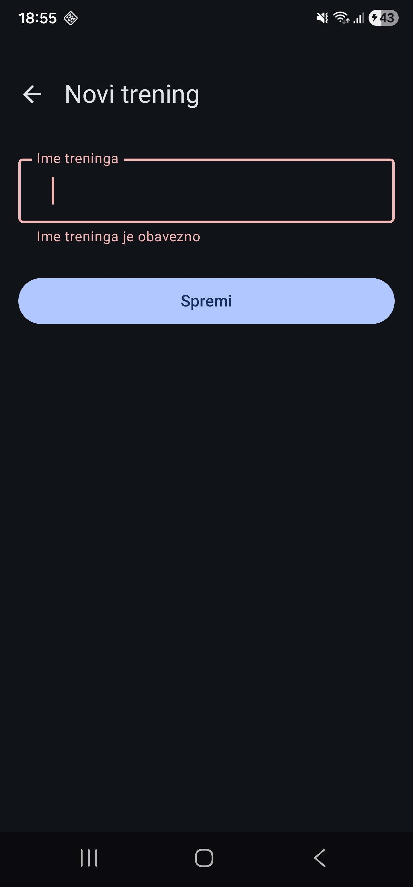
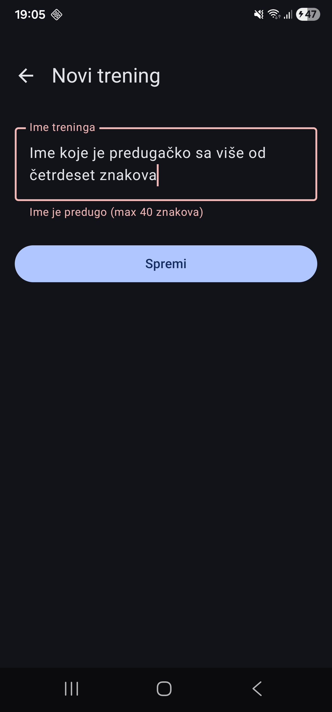

# Dan 5 – Detaljni plan: Dodavanje treninga (FAB + forma)

Do sada je dohvaćanje podataka o vježbama funkcioniralo tako da bi se pri pokretanju jednom pitalo Repository za dohvat svih podataka.

U ovoj vježbi ViewModel se pretplaćuje na Repositoryjev `StateFlow`, koji svaki put kada se sadržaj promijeni automatski obavještava ViewModel.

## FAB, aktivni Repository, `@Singleton`

### FAB

FAB je kratica za `FloatingActionButton`.

To je uredniji način za dodavanje vježbi — plutajući gumb u desnom kutu.

### Aktivni Repository

Do sada je `WorkoutRepository` vraćao trenutni popis pomoću funkcije `getAllWorkouts()`.

Danas se to mijenja u `StateFlow` svojstvo koje se može promatrati i koje javlja kada se sadržaj promijeni.

### `@Singleton`

`@Singleton` govori Hiltu da napravi točno jednu instancu ove klase za cijeli život aplikacije i da uvijek vrati tu istu instancu.

- Uveden je zbog toga što bi više instanci Repositoryja moglo imati različite podatke.
- Sve instance sada dijele isto stanje i promjene su vidljive svima.

## Vježbe

### 1. Dodavanje i pretraživanje treninga

Dodaj 2–3 nova treninga preko forme. Provjeri da ih polje za pretraživanje odmah pronalazi tako da upišeš dio imena treninga koji si upravo dodao.


### 2. Testiranje praznog naziva

Testiraj rubni slučaj: upiši samo razmake, na primjer tri puta pritisni razmaknicu, i klikni **Spremi**.

Treba li se pojaviti greška? Provjeri ponašanje — radi li `trim()` u `WorkoutCreateViewModel` svoje?



### 3. Zašto je Repository postao `@Singleton`?

Bez koda objasni zašto je `WorkoutRepository` morao postati `@Singleton` danas, kada to do jučer nije bilo potrebno.

`WorkoutRepository` je postao `@Singleton` zbog više instanci Repositoryja, tako da svi dijele isto stanje i da promjene budu vidljive svima.

### 4. Ograničenje duljine imena

Dodaj ograničenje duljine imena, na primjer maksimalno 40 znakova.

Ako je:

```kotlin
trimmed.length > 40
```

postavi:

```kotlin
_nameError.value = "Ime je predugo (max 40 znakova)"
```

umjesto spremanja treninga.

