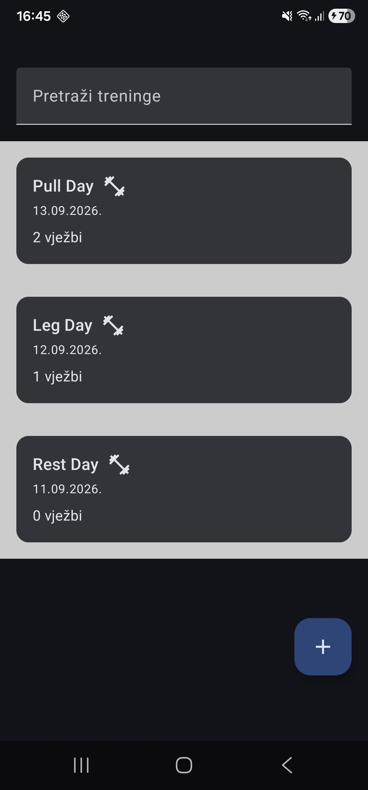
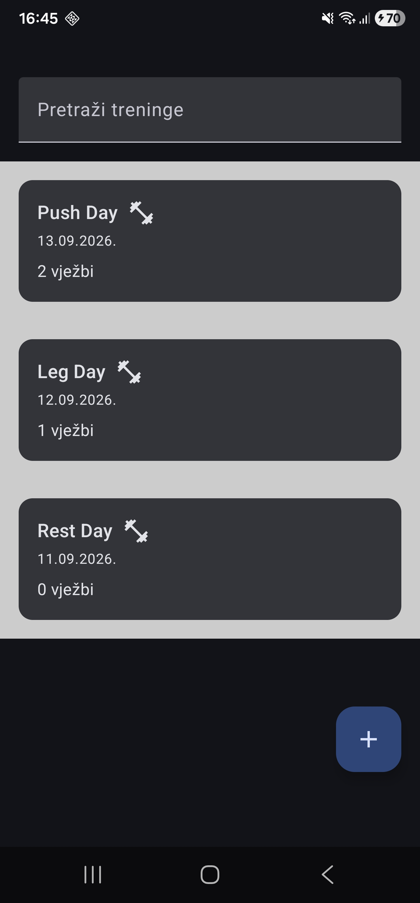
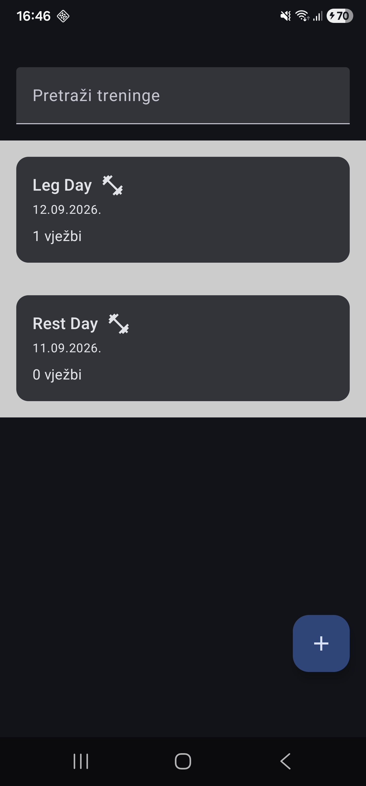

# Tjedan 1, Dan 7 – Detaljni plan: Uređivanje i brisanje

Do sada je aplikacija mogla:

- prikazati treninge;
- pretraživati treninge;
- otvoriti detalje treninga;
- dodati novi trening.

Danas dodajem:

- uređivanje postojećeg treninga;
- brisanje treninga;
- potvrdu prije brisanja pomoću `AlertDialoga`.

## Jedna forma za dodavanje i uređivanje

Izrađuje se jedna `WorkoutFormScreen` forma zato što je ekran za dodavanje treninga gotovo isti kao ekran za uređivanje treninga.

Razlika je u tome što:

- kod dodavanja forma počinje prazna;
- kod uređivanja forma prvo učita postojeći naziv treninga.

`WorkoutFormScreen` zato prima:

```kotlin
workoutId: Int?
```

Ako je:

```kotlin
workoutId == null
```

radi se o dodavanju novog treninga.

Ako `workoutId` ima vrijednost, na primjer:

```kotlin
workoutId == 5
```

radi se o uređivanju postojećeg treninga s ID-em `5`.

## `REPLACE` strategija

U DAO-u se koristi:

```kotlin
@Insert(onConflict = OnConflictStrategy.REPLACE)
```

Ista funkcija može služiti i za dodavanje i za uređivanje.

```text
id = 0 → dodaj novi red
id = 5 → zamijeni postojeći red s ID-em 5
```

Kod uređivanja se koristi postojeći trening i promijeni mu se samo naziv:

```kotlin
existing.copy(name = trimmed)
```

`copy()` zadržava:

- isti `id`;
- isti `dateMillis`;
- postojeći popis vježbi.

Mijenja se samo:

```kotlin
name = trimmed
```

Zatim se taj objekt ponovno spremi:

```kotlin
repository.addWorkout(existing.copy(name = trimmed))
```

Budući da objekt ima isti ID, `REPLACE` zamjenjuje stari red novim podacima. Roomova `REPLACE` strategija zamjenjuje postojeće podatke kada dođe do konflikta, primjerice zbog istog primarnog ključa. [52][55]

## Brisanje

Za brisanje se dodaje nova DAO funkcija:

```kotlin
@Query("DELETE FROM workouts WHERE id = :id")
suspend fun deleteById(id: Int)
```

Repository funkcija:

```kotlin
suspend fun deleteWorkout(id: Int) {
    workoutDao.deleteById(id)
}
```

`WHERE id = :id` je vrlo važan jer ograničava brisanje na jedan konkretan trening.

Bez `WHERE` uvjeta:

```sql
DELETE FROM workouts
```

obrisali bi se svi treninzi iz tablice.

## Vježbe

### 1. Uredi ime treninga

Uredi ime postojećeg treninga.

Zatim:

1. Zatvori aplikaciju potpuno.
2. Ponovno pokreni aplikaciju.
3. Provjeri je li novo ime ostalo spremljeno.

<p align="center">
  
  
</p>

### 2. Obriši trening

Obriši postojeći trening.

Zatim:

1. Zatvori aplikaciju potpuno.
2. Ponovno pokreni aplikaciju.
3. Provjeri da obrisani trening i dalje ne postoji.

<p align="center">
  
</p>

### 3. Zašto ne treba zasebna `updateWorkout` funkcija?

**Pitanje:**

Zašto `WorkoutFormViewModel` ne treba zasebnu `updateWorkout` funkciju u Repositoryju? Čime se uređivanje stvarno provodi?

**Odgovor:**

> Ne treba zasebnu `updateWorkout` funkciju jer smo s `@Insert(onConflict = OnConflictStrategy.REPLACE)` omogućili da ista `insert` funkcija radi i za dodavanje i za uređivanje. Ako je ID novi, Room dodaje novi red. Ako ID već postoji, Room zamijeni stari red novim podacima, što se ponaša kao ažuriranje.

Kod uređivanja:

```kotlin
repository.addWorkout(
    existing.copy(name = trimmed)
)
```

`existing` zadržava isti ID, pa Room zna koji red treba zamijeniti.

### 4. AlertDialog prije brisanja

Dodaj `AlertDialog` s pitanjem:

```text
Jesi li siguran?
```

Dialog se treba prikazati prije nego se stvarno pozove:

```kotlin
viewModel.deleteWorkout(workoutId, onBack)
```

Primjer:

```kotlin
var showDeleteDialog by remember {
    mutableStateOf(false)
}
```

Gumb za brisanje treba samo otvoriti dialog:

```kotlin
IconButton(
    onClick = {
        showDeleteDialog = true
    }
) {
    Icon(
        imageVector = Icons.Default.Delete,
        contentDescription = "Izbriši"
    )
}
```

`AlertDialog`:

```kotlin
if (showDeleteDialog) {
    AlertDialog(
        onDismissRequest = {
            showDeleteDialog = false
        },
        title = {
            Text("Izbriši trening?")
        },
        text = {
            Text("Jesi li siguran da želiš izbrisati ovaj trening?")
        },
        confirmButton = {
            TextButton(
                onClick = {
                    showDeleteDialog = false
                    viewModel.deleteWorkout(workoutId, onBack)
                }
            ) {
                Text("Izbriši")
            }
        },
        dismissButton = {
            TextButton(
                onClick = {
                    showDeleteDialog = false
                }
            ) {
                Text("Odustani")
            }
        }
    )
}
```