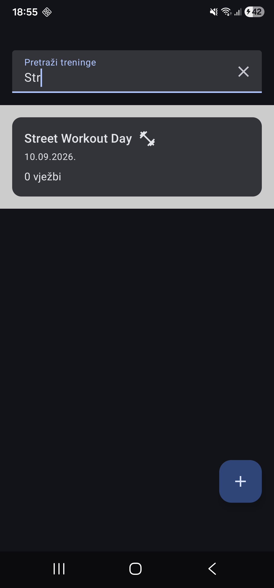
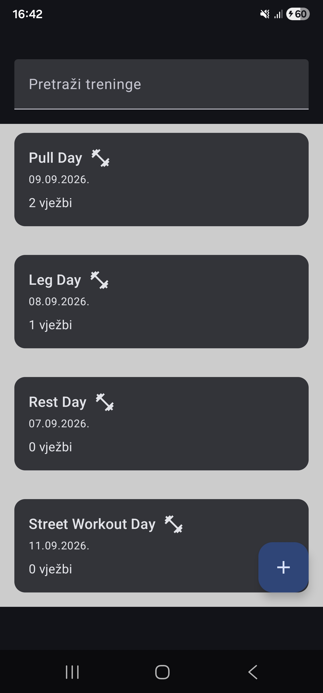

# TrainingTracker


An Android app for logging gym workouts — exercises, sets, reps, weight — built offline-first with a modern MVVM architecture. Started as a hands-on portfolio project to practice production-style Android patterns beyond tutorial-level apps.

## About

TrainingTracker lets you log workouts and see your training history, fully offline. No account, no backend, no internet required — your data lives on your device from the moment you create it. It's being actively built out toward a fuller feature set, including cloud sync and accounts, as time and learning progress allow.

## Features

**Done**
- [x] Browse a list of logged workouts
- [x] Live search/filter workouts by name
- [x] View workout details (exercises, sets, reps, weight)
- [x] Add a new workout through a validated form
- [x] Offline-first local persistence — data survives app restarts, no internet needed
- [x] Add / edit exercises within a workout
- [x] Edit and delete existing workouts

**Planned**
- [ ] User accounts (register / login)
- [ ] Backend sync (REST API + PostgreSQL)
- [ ] Workout statistics and progress charts
- [ ] Favorite exercises
- [ ] Push notification reminders

## Tech Stack

- **Kotlin**
- **Jetpack Compose** — UI toolkit
- **Navigation 3** — screen navigation (list → detail → create)
- **Hilt** — dependency injection
- **Room** — local database (SQLite)
- **Kotlin Coroutines & Flow** — async data and reactive state
- **Gson** — JSON serialization for embedded data

## Architecture

Layered MVVM with a single source of truth:

```
UI (Compose)  ⇄  ViewModel (StateFlow)  ⇄  Repository  ⇄  Room (SQLite)
```

A few deliberate decisions worth calling out:

- **Room is the source of truth, not a cache.** A workout only exists because the user created it — there's no external API supplying it. Local storage is the origin of the data, not a copy of something else.
- **Repository pattern** keeps a single place responsible for where data comes from. ViewModels never talk to Room directly, so the data source can change without touching the UI layer.
- **Hilt** manages object creation and scoping (e.g. one shared `WorkoutRepository` instance app-wide) instead of manual dependency wiring.
- **Navigation 3** is used instead of the older Navigation Compose — it treats the back stack as plain observable state rather than a hidden graph, and is Google's current recommended navigation library (stable since November 2025).

## Screenshots

| Workouts | Add & Search | Offline |
|:---:|:---:|:---:|
|  |  |  |

## Getting Started

1. Clone the repository
2. Open in a recent version of Android Studio
3. Let Gradle sync
4. Run on an emulator or physical device

No backend or API keys needed — everything runs locally.

## Project Structure

```
Workout.kt, Exercise.kt          — domain models (also Room entities)
DummyData.kt                     — seed data for first launch
WorkoutDao.kt, AppDatabase.kt    — Room persistence
Converters.kt                    — Room type converter (JSON for exercise lists)
WorkoutRepository.kt             — single source of truth for workout data
DatabaseModule.kt                — Hilt bindings
WorkoutListViewModel/Screen.kt   — workout list + search
WorkoutDetailViewModel/Screen.kt — workout detail view
WorkoutCreateViewModel/Screen.kt — add-workout form
MainActivity.kt                  — navigation host
```