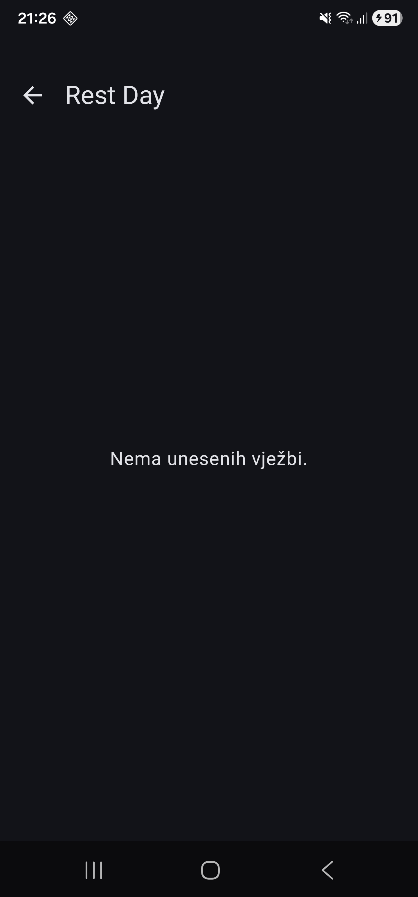
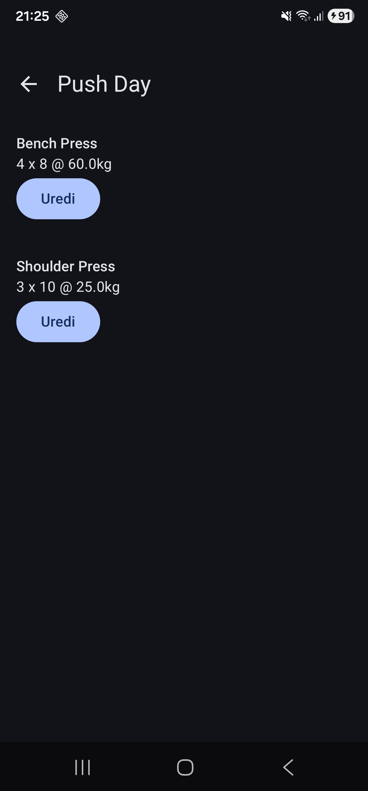
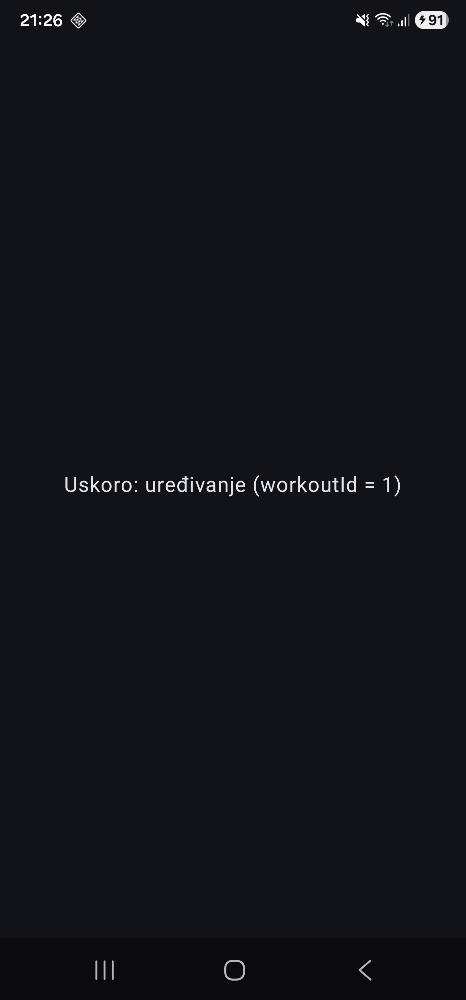

# Tjedan 1, Dan 3 – Navigacija (Navigation 3)

## Navigation 3

- Back stack kao obična lista:

  ```kotlin
  val backStack = mutableStateListOf(WorkoutList, WorkoutDetail(3))
  ```

- Otvoriš novi ekran (dodaš na kraj liste) ili ideš natrag (makneš zadnji element):

  ```kotlin
  backStack.add(WorkoutDetail(5))   // idi naprijed
  backStack.removeLastOrNull()      // idi natrag
  ```

- UI samo gleda tu listu tako da prikaže ono što je zadnje u listi:

  ```kotlin
  val currentScreen = backStack.last()
  ```

Lista se odmah stavlja u ViewModel zbog rotacije:

```kotlin
class NavigationViewModel : ViewModel() {
    val backStack = mutableStateListOf<Any>(WorkoutList)

    fun navigateTo(screen: Any) {
        backStack.add(screen)
    }

    fun goBack() {
        backStack.removeLastOrNull()
    }
}
```

---

## Ključevi, NavEntry, entryProvider, NavDisplay

### Ključ (key)

Obična Kotlin `data class`/`object` koja identificira jedan ekran i podatke koje taj ekran treba – "koji ekran + koji parametri":

```kotlin
data object WorkoutList          // postoji samo 1 takav ključ
data class WorkoutDetail(val workoutId: Int) // svaka instanca je drugi ključ za drugi trening
```

### NavEntry

Veza između ključa i UI-a – "za ovaj ključ na vrhu stoga prikaži ovaj Composable".

### entryProvider

"Za svaki ključ reci koji je NavEntry" – na temelju ključa odluči se koji Composable pokrenuti.

### NavDisplay

- Prima:
    - `backStack` (listu ključeva)
    - `entryProvider` (pravilo "ključ → UI")
- Gleda zadnji element na vrhu stoga i pita `entryProvider` što se treba prikazati za određeni ključ.
- Prikaže UI.

Kad se lista promijeni, `mutableStateListOf` detektira promjenu, `NavDisplay` se rekomponira, uzme se zadnji element i prikaže novi ekran.

---

## Vježbe

### 1. Prazno stanje za "Rest Day"

Klikni na "Rest Day" (0 vježbi) – detail ekran bi trebao prikazati prazan prostor bez pucanja. Dodaj `if (workout.exercises.isEmpty())` unutar `else` grane koja prikaže `Text("Nema unesenih vježbi.")` umjesto prazne `LazyColumn`.

{width=250}

---

### 2. Treba li WorkoutDetailScreen ViewModel?

U `WorkoutDetailScreen`, `workout` se traži preko `DummyData.workouts.find { it.id == workoutId }` – dakle i detail ekran, kao i lista jučer, izravno ovisi o `DummyData`.

**Pitanje:** Kad kasnije dodamo Room, treba li i `WorkoutDetailScreen` dobiti svoj ViewModel (npr. `WorkoutDetailViewModel`) umjesto direktnog pristupa `DummyData`-i? Zašto ili zašto ne?

**Odgovor:**

`WorkoutDetailScreen` treba dobiti svoj ViewModel kako bismo razdvojili mjesto gdje se nalazi logika za dohvaćanje treninga s određenim ID-om.  
`DummyData` je lista u memoriji koja je uvijek dostupna, dok za Room trebamo napraviti niz akcija: upit u bazu, mogućnost da podatak još ne postoji i da upit još traje.  
S ViewModelom Composable postane samo: "daj mi `workout` iz ViewModela i ja ću ga prikazati".

---

### 3. Sistemska back tipka vs. strelica u appu

Testiraj: klikni na trening, pa ponovno klikni "natrag" tipkom telefona (ne strelicom u appu) – radi li identično kao strelica u `TopAppBar`-u? Zašto/zašto ne bi trebalo raditi identično?

**Odgovor:**

I strelica u appu i sistemska back tipka rade identično s obzirom na to koji se ekran prikaže – oba puta se poziva `backStack.removeLastOrNull()` na istoj listi, pa `NavDisplay` reagira isto jer gleda samo stanje liste, a ne izvor promjene.

---

### 4. Treći ključ i ekran (WorkoutEdit)

Dodaj treći ključ i ekran po želji (npr. `WorkoutEdit(val workoutId: Int)` s praznim placeholder ekranom `Text("Uskoro: uređivanje")`) – samo da uvježbaš dodavanje trećeg ključa u `entryProvider` bez da razmišljaš o punoj funkcionalnosti.

{width=250}

{width=250}