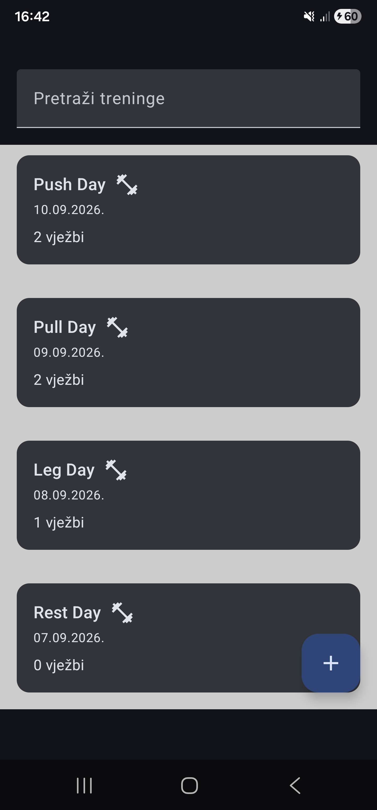

# Tjedan 1, Dan 6 – Detaljni plan: Room

Trenutno ostanu samo default DummyData treninzi nakon što se napusti aplikacija.
Room rješava to tako što sprema na disk i s time novo dodani treninzi prežive gašenje aplikacije.

## Dijelovi Rooma

- **`@Entity`** - jedan redak u tablici
- **`@Dao`** - što se smije raditi s tablicom
- **`@Database`** - spaja oboje

Zbog toga što `Workout` sadrži `exercises: List<Exercise>` potrebno je pretvaranje liste u JSON tekst jer baza zna samo spremiti text/brojeve.

***

## U projektu prema planu mijenjani su i stvarani sljedeći fajlovi:

### **Novi fajlovi (stvoreni u Bloku 3):**

1. **`build.gradle.kts`** (Module :app) *(izmijenjen – dodane Room i Gson zavisnosti)*

    - `room-runtime` + `room-ktx` = baza radi
    - `room-compiler` = generira kod za tebe
    - `gson` = pretvara liste u JSON

2. **`Converters.kt`**

   Pošto baza zna spremiti samo jednostavne tipove: `Int`, `String`, `Long`... => `List<Exercise>` je kompliciran objekt i baza ne zna što je to, tako je rješenje pretvoriti listu u JSON tekst, spremiti to a kad se čita pretvoriti natrag u listu.

3. **`WorkoutDao.kt`**

    - `Dao` = Data Access Object - definira što smiješ raditi s tablicom
    - Tu se pišu SQL upiti.

4. **`AppDatabase.kt`**

   Spaja sve skupa jer je glavna klasa za Room bazu.
   Tu se kažu sve informacije kao što su tablice (`entities`), verzija baze ili pretvarači (`Converters`).

5. **`DatabaseModule.kt`**

   Da bi Hilt znao kako stvoriti `AppDatabase` i `WorkoutDao`. Sve to pod 1 instancom baze `@Singleton`.

***

### **Postojeći fajlovi koji su izmijenjeni (modificirani):**

6. **`Workout.kt`** *(dodane `@Entity`, `@PrimaryKey` te zadana/default vrijednost za `exercises`)*

    - Uvedeno kako bi Room znao koju tablicu stvoriti u bazi.
    - Svaki `@Entity` predstavlja jednu tablicu.
    - `@PrimaryKey(autoGenerate = true)` - baza sama dodjeljuje ID.

7. **`WorkoutRepository.kt`** *(uklonjen `nextId()`, `addWorkout` prebačen u `suspend`, dodan `seedIfEmpty()` i rad s DAO-om)*

    - Repository sada koristi `workoutDao` za rad s bazom tako da čita podatke i piše u Room bazu.
    - Sada varijabla za dohvaćanje treninga je `Flow`, a ne `StateFlow`, jer Room sam upravlja podacima i šalje ih kad se podaci u bazi promijene, a ne kad netko zatraži. ViewModel se pretplati na taj `Flow` i prima obavijesti svaki put kad se baza promijeni.

8. **`WorkoutListViewModel.kt`** *(dodan poziv `seedIfEmpty()`, pretplaćivanje na `Flow` iz baze)*

    - `repository.workouts.collect { ... }` - ViewModel pretplati se na promjene iz baze.
    - `seedIfEmpty()` - osiguraj da baza nije prazna i ubaci početne treninge samo ako je baza prazna.

9. **`WorkoutCreateViewModel.kt`** *(poziv `addWorkout` stavljen u `viewModelScope.launch`, uklonjeni nepotrebni `id`/`exercises` pri stvaranju objekta)*

    - Spremanje u bazu podataka.
    - Sada je `addWorkout` `suspend` funkcija i zove se unutar `viewModelScope.launch`-a kako ne bi došlo do zamrzavanja UI-a, jer sada radi upis na disk (Room bazu), što je operacija koja može potrajati i ne smije blokirati glavnu nit.

10. **`WorkoutDetailViewModel.kt`** *(poziv `getWorkoutById` stavljen u `viewModelScope.launch`)*

    - Čitanje iz baze.
    - `suspend` funkcije se zovu unutar `viewModelScope.launch` zbog iste situacija kao kod 9.

***

## Vježbe

1. Dodaj trening, zatvori app potpuno, ugasi mobilne podatke/WiFi, ponovno otvori – trening je i dalje tu (Room ne treba internet).

   

2. Obriši app podatke (Postavke → Aplikacije → TrainingTracker → Pohrana → Obriši podatke), pokreni app. Trebaju se vratiti default 4 treninga, bez ijednog koji si sam ranije dodao.

   

3. *(Bez koda)* Zašto smo `nextId()` mogli jednostavno obrisati, umjesto da je i dalje pozivamo negdje?

   Zbog toga što sada baza automatski dodjeljuje id svakom treningu preko `@PrimaryKey(autoGenerate = true) val id: Int = 0`.