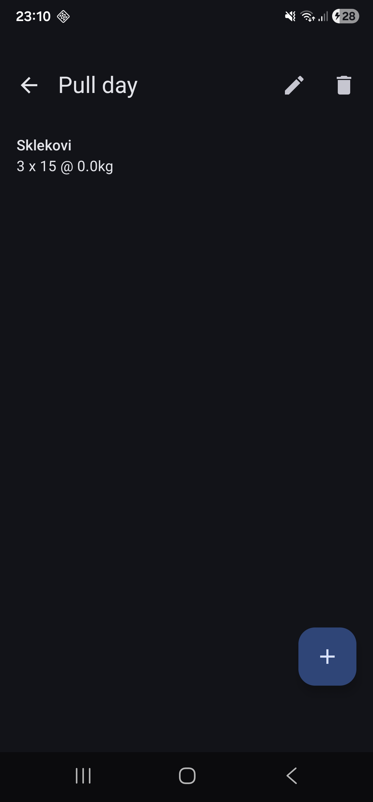
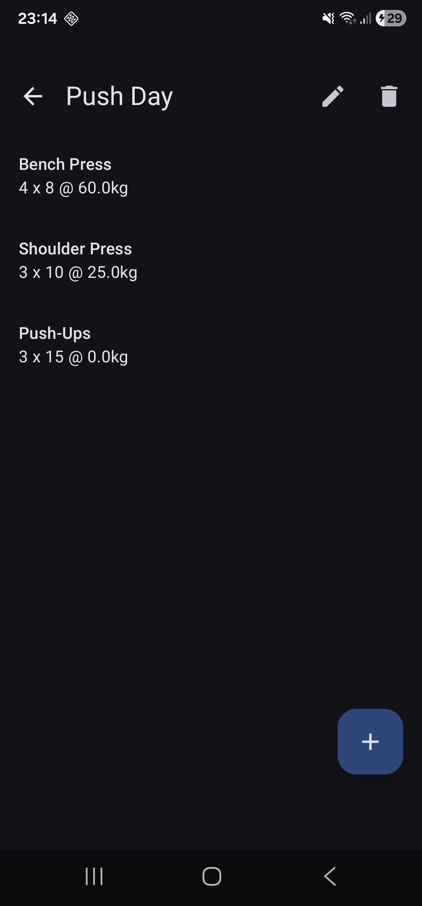

# Tjedan 2, Dan 1 – Detaljni plan: Dodavanje vježbi u trening

## Dodavanje vježbi uz pomoć '+'

Kreiramo novu listu zbog toga što `List` u Kotlinu nema `add()` jer je immutable (ne može se mijenjati).

Ovo radimo jer StateFlow i Compose primjećuju promjenu i ažuriraju UI tek nakon što se usporede stara i nova vrijednost.

Ovako se promijeni referenca na novo kreirani objekt stoga Room i Flow prepoznaju promjenu.

***

## Promjena polja objekta

```kotlin
repository.addWorkout(existing.copy(name = trimmed))
```

- `.copy()` - napravi novi `Workout` i prepiše sva polja iz starog, a promijeni se samo ono što se navede.
- `copy()` zadrži id, `insert` s `REPLACE` prepiše stari red.

```kotlin
val updated = workout.copy(exercises = workout.exercises + exercise)
```

***

## Razlog zašto polja forme drže `String`, a ne `Int`

Polja forme drže `String` jer korisnički unos može biti prazan tekst (`""`) ili neispravan tekst (npr. `"abc"`). Da polja drže `Int`, prazan unos bi morao biti `0` ili `null`, što ne bi imalo smisla za UI – korisnik bi vidio `0` u polju umjesto praznog polja.

***

## Vježbe

### 1. Dodaj vježbu s kilažom 0

Dodaj vježbu s kilažom 0 (npr. "Sklekovi", 3, 15, 0) — treba proći bez greške. Zatim probaj `-5` — treba javiti grešku. Ako oboje radi kako treba, tvoja `weightValue < 0` provjera je ispravna.

<p align="center">
  
  
</p>

***

### 2. Dodaj vježbu u jedan od četiri DummyData treninga

Dodaj vježbu u jedan od četiri DummyData treninga (npr. Push Day, koji već ima dvije vježbe). Provjeri da se NOVA vježba dodaje na kraj, a stare dvije ostaju — to je `workout.exercises + exercise` u akciji.



***

### 3. (Bez koda) Što bi se dogodilo da si u `addExerciseToWorkout` napisao `workoutDao.insert(Exercise(...))` umjesto `workoutDao.insert(updated)`? Zašto to uopće ne bi prošlo kompajliranje?

To uopće ne bi prošlo kompajliranje jer `workoutDao.insert()` očekuje `Workout` objekt, a ne `Exercise`.

`Exercise` je potpuno drugi tip – to je podatak unutar treninga, a ne sam trening.

***

### 4. (Stretch) Trenutno se forma ne prazni ako u istom ekranu ne možeš dodati dvije vježbe zaredom. Razmisli: kako bi napravio da nakon spremanja ekran ostane otvoren, ali s praznim poljima, spreman za sljedeću vježbu? Koje bi funkcije trebao promijeniti?

Dodao sam `clearForm()` funkciju:

```kotlin
fun clearForm() {
    _name.value = ""
    _sets.value = ""
    _reps.value = ""
    _weight.value = ""
    _error.value = null
}
```

I pozvao je u `onSaveClick()`:

```kotlin
fun onSaveClick(workoutId: Int, onSaved: () -> Unit) {
    viewModelScope.launch {
        repository.addExerciseToWorkout(...)
        clearForm()  // ← očisti formu
        onSaved()    // ← zatvori ekran
    }
}
```