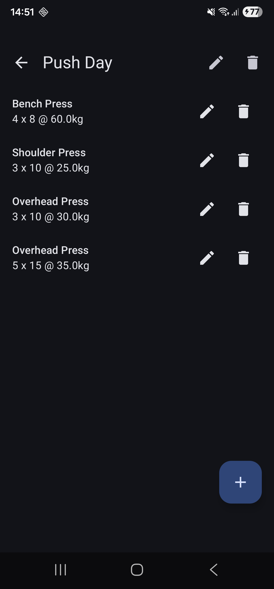
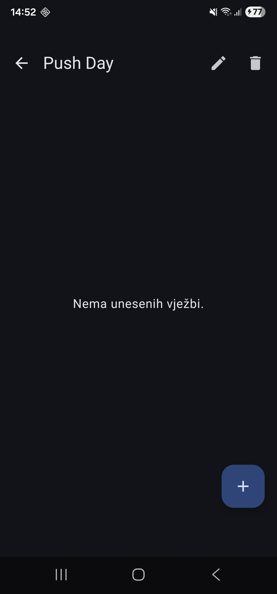

# Tjedan 2, Dan 2 – Zašto vježbi treba `id`

## Problem

Kako identificirati točno određenu vježbu unutar treninga?

```
1. Bench Press — 4 x 8 @ 60kg
2. Bench Press — 2 x 12 @ 40kg
```

- Po imenu ne može – ista su.
- Po indeksu ne može – indeks se pomiče kad se nešto obriše/doda.
- Po drugim poljima ne može – bilo koja kombinacija može se ponoviti.

## Zašto ne `autoGenerate` kao kod `Workout`?

- Vježbe se ne spremaju u svoju tablicu.
- Spremaju se kao **JSON string** unutar `Workout` tablice.
- Room vježbe vidi samo kao tekst, ne kao zasebne retke → ne može im dodjeljivati ID-ove.

## Rješenje: UUID

Svaka vježba dobiva svoj `id`:

```kotlin
val id: String = UUID.randomUUID().toString()
// npr. "a3f5c1e2-7b91-4d88-9f2e-1c4b6a8d0e73"
```

- Jedinstven je.
- Ne ovisi o drugim vježbama.
- Ne zahtijeva čitanje postojećih vježbi (kao "najveći + 1").

## map

Uvodi se `map` koji prolazi kroz svaki element liste i za svaki pita "što stavljam umjesto njega?". Rezultat je nova lista iste duljine.

```kotlin
workout.exercises.map { if (it.id == exercise.id) exercise else it }
```

→ "ako joj je id isti kao onaj koji mijenjam, stavi novu verziju; inače je ostavi točno takvu kakva je"

## filter - za brisanje elemenata

```kotlin
workout.exercises.filter { it.id != exercise.id }
```

→ "zadrži svaku vježbu čiji id nije onaj koji brišem"

## Bacanje starih podataka

- `exercises` stupac je tipa `TEXT` → Room ne vidi promjenu kad dodaš `id` u `Exercise`.
- Stari JSON nema `id` → Gson ga ostavi praznog → `id` bude `null`.
- Kod kompajlira, ali app pukne kad se klikne **uredi** ili **obriši** na staroj vježbi.

### Rješenje

- Napravljena je **destruktivna migracija** (briše sve i kreće ispočetka).
- To je OK jer su podaci bili **testni**.
- U **produkciji** bi išla prava migracija koja postojećim vježbama dodijeli `id` (npr. generira UUID za svaku).
- Nakon migracije, `seedIfEmpty()` ponovno ubaci default treninge s ispravnim `id`-evima.

## Vježbe

### 1. Dodaj dvije vježbe s istim imenom

Dodaj dvije vježbe s istim imenom u isti trening (npr. dva puta "Overhead Press", različite kilaže). Uredi drugu. Prva mora ostati nepromijenjena — to je cijeli razlog zašto `id` postoji.

<p align="center">
  
  
</p>

### 2. Obriši sve vježbe iz treninga

Obriši sve vježbe iz jednog treninga, jednu po jednu. Nakon zadnje, ekran treba pokazati "Nema unesenih vježbi." — provjeri da se to stvarno dogodi bez ponovnog ulaska u ekran.

<p align="center">
  
  
</p>

### 3. (Bez koda) U `deleteExerciseFromWorkout`, što bi se dogodilo da si napisao `filter { it.id == exerciseId }` umjesto `!=`?

Prikazala bi se samo ona vježba koja se briše, a ne kako zapravo treba da ostanu one koje se nisu obrisale.

### 4. (Bez koda) U Koraku 5, rješenje kaže da `existing.copy(...)` mora zadržati isti `id`. Prati što bi se točno dogodilo da si umjesto toga napravio potpuno novi `Exercise(...)` — gdje bi se lanac prekinuo?

Lanac bi se prekinuo kod identifikacije, jer s `copy()` zadržavamo `id` što omogućuje da se točno zna koju vježbu mijenjaš. Kad bi se koristio `Exercise(...)`, svaki put bi se stvarao novi `id`.
