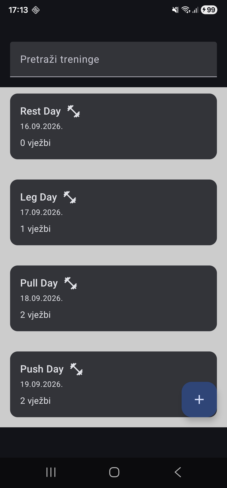
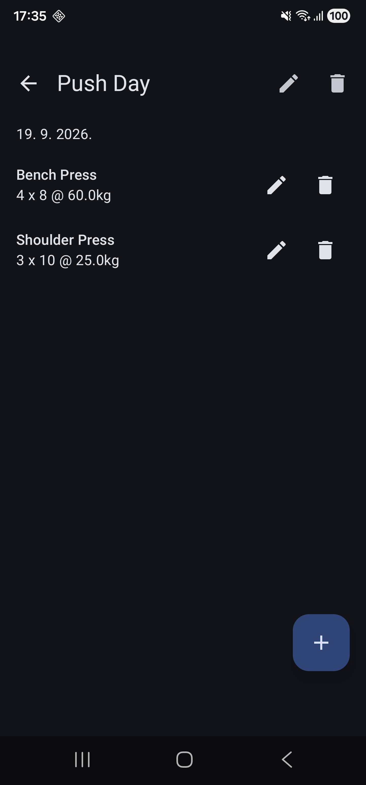

# Tjedan 2, Dan 3 – Datum treninga i sortiranje

Trenutno aplikacija radi da se datum dodijeli na kreiranju određenog treninga. Stoga definicija sortiranja nije imala smisla i s time uvodimo opciju biranja datuma kad se kreira trening.

Uvodimo specijalizirani UI widget koji pamti trenutno stanje, prikazuje kalendar i ima opcije "OK"/"Odustani".

DatePickerDialog koristi `rememberDatePickerState()` za privremeno pamćenje odabranog datuma dok je dijalog otvoren. Kad korisnik klikne "OK", dohvatimo `selectedDateMillis` iz tog stanja i spremimo ga u ViewModel, odakle ide u bazu.

| Dio                       | Zašto postoji?                                                     |
| ------------------------- | ------------------------------------------------------------------ |
| `rememberDatePickerState()` | Da se pamti izbor dok korisnik bira (privremeno)                   |
| `DatePicker`                | Da se može koristiti samostalno (ne samo u dijalogu)               |
| `DatePickerDialog`          | Da ne moraš svaki put ručno raditi AlertDialog s kalendarom unutra |

***

## Vježbe

### 1. Promjena sortiranja u ASC

Privremeno promijeni `DESC` u `ASC` u `WorkoutDao`, pokreni app, provjeri da se redoslijed obrne (najstariji prvi). Vrati na `DESC`.

***

### 2. Tri treninga s različitim datumima

Dodaj tri treninga s tri različita datuma namjerno unesenim ne-kronološkim redoslijedom (npr. prvo unesi datum od prije 2 dana, pa danas, pa od prije 10 dana). Provjeri da se na listi ipak pojave KRONOLOŠKI sortirani, bez obzira kojim si ih redoslijedom unio.

***

### 3. Gdje dodati datum na DetailScreen?

**(Bez koda)** WorkoutDetailScreen trenutno ne prikazuje datum treninga nigdje, samo ime u naslovu. Gdje bi ga dodao, i koju bi funkciju pritom pozvao da ga formatiraš?

Dodao bi ga odmah ispod naziva. Pozvao bi novo dodanu `toFormattedDate()` ekstenzijsku funkciju. Pretvara `Long` (ms) u čitljiv datum.

***

### 4. Stretch – prikaz datuma na DetailScreen

**(Stretch)** Dodaj taj prikaz datuma iz zadatka 3 — jedan `Text` s `currentWorkout.dateMillis.toFormattedDate()`, negdje ispod naslova ili iznad liste vježbi.

