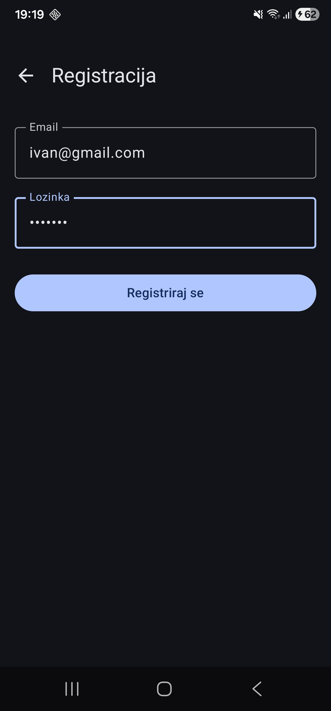

# Tjedan 2, Dan 7 – Detaljni plan: Android kontaktira backend

## Proces slanja HTTP zahtjeva i pretvaranja JSON u Kotlin objekte

- HTTP metodu — `@POST`;
- endpoint — `"api/login"`;
- podatke koje šalješ — `@Body request`;
- podatke koje očekuješ natrag — `LoginResponse`.

Retrofit zatim sam napravi stvarni HTTP poziv.

```kotlin
interface AuthApi {
    @POST("api/login") // metoda i putanja
    suspend fun login(@Body request: LoginRequest): LoginResponse // uzmi Kotlin objekt request, pretvori ga u JSON i pošalji ga kao HTTP body.
}
```

## Android emulator

- program koji glumi pravi Android mobitel

Kod backenda koristimo `localhost:3000` koji Emulator ne prepoznaje.  
Stoga za pokretanje i testiranje aplikacije i backenda potrebno je koristiti adresu `10.0.2.2` koju Android emulator preusmjerava na `127.0.0.1`, odnosno locahost računala.

## Vježbe

### 1. RegisterScreen i RegisterViewModel

Napravi `RegisterScreen` i `RegisterViewModel`, po uzoru na `LoginScreen`/`LoginViewModel` — isto polje email/password, ali zove `authRepository.register(...)`, i pri uspjehu vrati korisnika na Login ekran (ne izravno prijavljenog) s porukom "Registracija uspješna, sad se prijavi". Poveži ga dugmetom "Nemaš račun? Registriraj se" na `LoginScreen`.



### 2. PasswordVisualTransformation

Dodaj `visualTransformation = PasswordVisualTransformation()` na polje za lozinku (treba import `androidx.compose.ui.text.input.PasswordVisualTransformation`) — provjeri da se sad prikazuju točkice umjesto teksta.


### 3. Različite poruke greške

**(Bez koda)** Trenutno, ugasiš li WiFi na emulatoru i pokušaš login, dobiješ istu poruku kao za krivu lozinku. Zašto bi u pravoj app to trebale biti dvije različite poruke, i gdje bi u kodu to razlikovao?

U pravoj aplikaciji to trebaju biti dvije različite poruke zato što uzrok i sljedeća akcija korisnika nisu isti. Ako je lozinka pogrešna, korisnik treba provjeriti ili ponovno upisati email i lozinku. Ako nema interneta ili server ne radi, ponovno upisivanje lozinke neće pomoći — korisnik treba provjeriti Wi‑Fi/mobilne podatke ili pokušati ponovno kasnije.

Razlikovanje bih napravio u `LoginViewModelu`, unutar `onLoginClick`, u `catch` bloku. Umjesto jednog općeg `catch (e: Exception)`, provjerio bih vrstu greške: mrežnu grešku poput `IOException` prikazao bih kao “Nema internetske veze” ili “Nije moguće spojiti se na server”, a HTTP `401 Unauthorized` kao “Pogrešan email ili lozinka”. Ostale neočekivane greške prikazao bih općom porukom.

### 4. Odjava

**(Stretch)** Dodaj gumb "Odjava" negdje (npr. na `WorkoutListScreen`) koji pozove `tokenStorage.clearToken()` — trebat će ti Repository funkcija koja to izloži, po uzoru na `deleteWorkout`.

```kotlin
IconButton(
    onClick = viewModel::onLogoutClick
) {
    Icon(
        imageVector = Icons.AutoMirrored.Filled.Logout,
        contentDescription = "Odjava"
    )
}
```