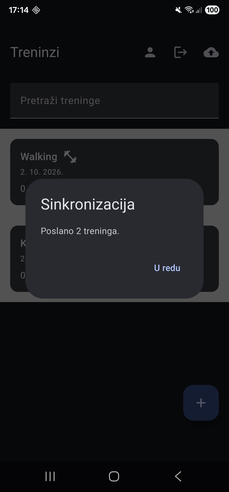

# Tjedan 3, Dan 3 – Detaljni plan: Android šalje treninge na backend

Potrebno je uvesti token tijekom svakog zahtjeva za dohvatit treninge ili ih spremiti.

Uvodimo interceptor kao opciju da ne trebamo za svaku funkciju ručno dodavati token i poslati ga.

Interceptor - OkHttpov način gdje funkcija presretne svaki odlazeći zahtjev, prije nego stvarno ode na mrežu i po potrebi ga izmjeni.

Tako sa ovim imamo da svaki Retrofit poziv, iz bilo kojeg API sučelja, automatski nosi token.

## U Supabase-u

```text
id,user_id,name,date_millis,exercises
1,7,Walking,1790948183841,[]
2,7,Kickbox,1790948172258,[]
```

## Preko Thunder Clienta

```json
[
  {
    "id": 1,
    "user_id": 7,
    "name": "Walking",
    "date_millis": "1790948183841",
    "exercises": []
  },
  {
    "id": 2,
    "user_id": 7,
    "name": "Kickbox",
    "date_millis": "1790948172258",
    "exercises": []
  }
]
```

## Na mobitelu



***

# Vježbe

## 1. Brisanje tokena i sync

Privremeno izbriši token (`tokenStorage.clearToken()`, pozovi je ručno negdje ili kroz gumb za odjavu ako si ga napravio na Danu 7) i pokreni sync. Otvori Logcat, potraži stvarnu grešku koju `authApi`/`workoutApi` baci — je li to 401, ili nešto o mreži?

```text
retrofit2.HttpException: HTTP 401 Unauthorized
```

Bez tokena sync vraća 401 Unauthorized, što znači da AuthInterceptor radi i backend ispravno odbija neautentificirane zahtjeve.

***

## 2. Logiranje slanja treninga

Dodaj `android.util.Log.d("Sync", "Šaljem: ${workout.name}")` unutar for petlje u `pushAllWorkouts` — pokreni sync, prati Logcat, potvrdi da se svaki trening stvarno pokuša poslati, redom.

```text
2026-10-02 16:59:32.379  5857-5857  Sync  com.ivanb.trainingtracker  D  Šaljem: Walking
2026-10-02 16:59:32.502  5857-5857  Sync  com.ivanb.trainingtracker  D  Šaljem: Kickbox
```

***

## 3. Interceptor i login poziv

**(Bez koda)** Interceptor presreće SVAKI odlazeći Retrofit poziv, uključujući `authApi.login(...)`. Zašto to ne predstavlja problem, iako login poziv nema (i ne treba imati) token u tom trenutku?

Interceptor presreće i login poziv, ali to nije problem jer prije prijave token ne postoji.

Login ne koristi JWT zato što je njegova svrha upravo da server provjeri email i lozinku te tek onda vrati JWT token.

Unutar AuthInterceptor imamo else dio grane koji poziva `chain.request()` gdje login ode na backend bez headera kako i treba biti.

Tek nakon uspješnog logina token se spremi stoga interceptor doda Bearer token za buduće pozive.

***

## 4. Stretch – Logiranje AuthInterceptora

**(Stretch)** U `AuthInterceptor`, dodaj `Log.d` koji ispiše URL zahtjeva (`chain.request().url`) i je li token dodan ili ne — koristan alat za buduće dane kad nešto krene po zlu s mrežom.

### Prije prijave

```text
2026-10-02 17:08:40.484  7940-8043  AuthInterceptor  com.ivanb.trainingtracker  D  URL: http://192.168.100.7:3000/api/login | Token dodan: false
```

### Nakon prijave

```text
2026-10-02 17:08:43.048  7940-8043  AuthInterceptor  com.ivanb.trainingtracker  D  URL: http://192.168.100.7:3000/api/workouts | Token dodan: true
```